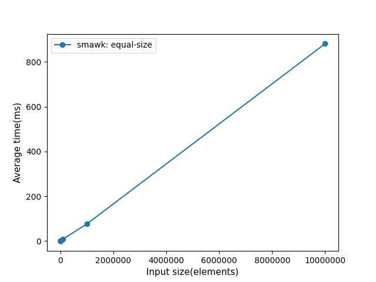
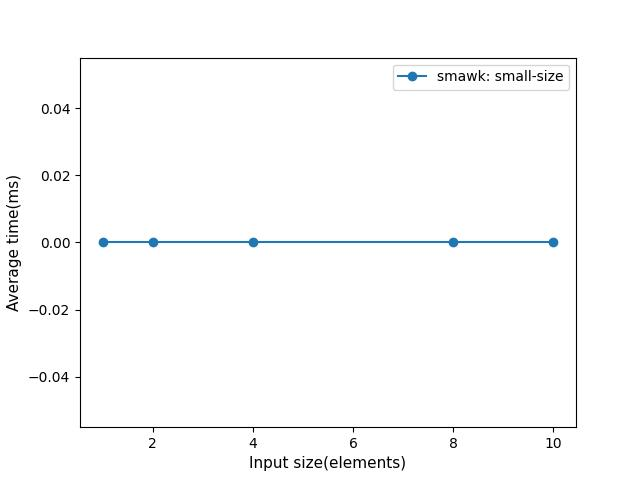
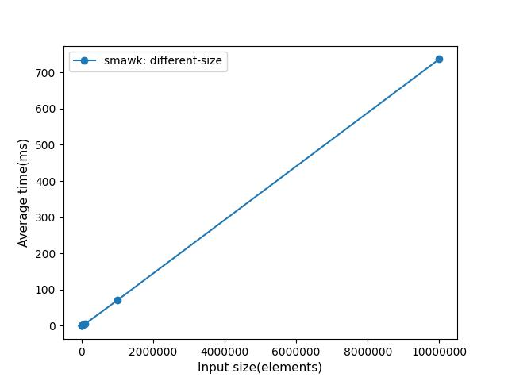

# convex convolution
### 
***

_Two vectors **a**, **b** of size **N**, **M** are given. One of these vectors is convex._
_Convex (min,plus) convolution calculates vector **c** in  O(N+M)  time complexity._ 

***
### Building

- Release build
```
cmake -B build -DCMAKE_CXX_COMPILER=clang++ -DCMAKE_BUILD_TYPE=Release .
cmake --build build
```
- Debug build
```
cmake -B debug -DCMAKE_CXX_COMPILER=clang++ -DCMAKE_BUILD_TYPE=Debug .
cmake --build debug
```
***
### Usage  
After building there are would be 3 files you need in **build/debug** directory:
- main file ```./out```
- tests ```./test_out```
- benchmarks ```./g_bench``` or ```./g_bench --benchmark_format=json > <your_filename>.json``` to write result to <your_filename>.json file
- plot results ```python3 ../bench/plot_data.py <your_filename>.json all-zero``` or  ```python3 ../bench/plot_data.py <your_filename>.json small-size``` or ```python3 ../bench/plot_data.py <your_filename>.json equal-size```
***
### Results
- Sequences a and b are **equal-sized**:
  


- **Small size**:
  


- **Different sizes**:
  

